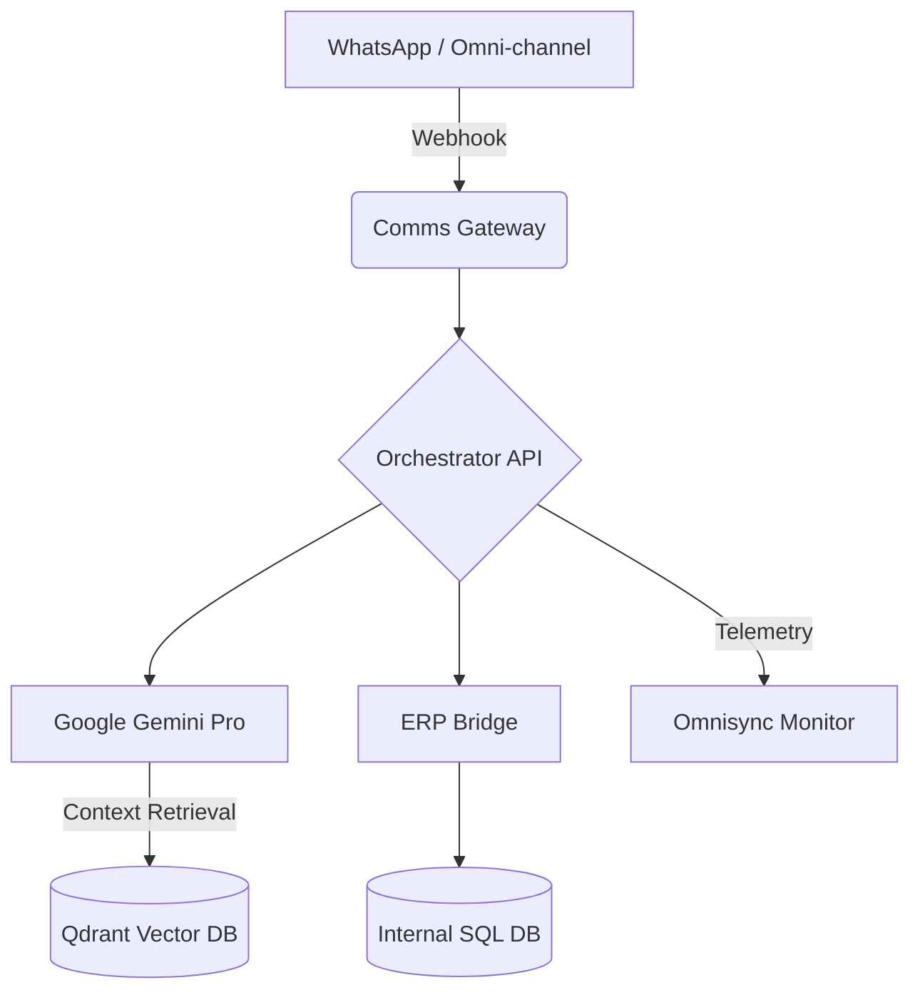

# 🧠 Omnisync-AI: Neural Enterprise Infrastructure

[](https://opensource.org/licenses/MIT)
[](https://nx.dev)
[](https://nestjs.com)
[](https://deepmind.google/technologies/gemini/)

**Omnisync-AI** no es simplemente un chatbot; es una infraestructura neural descentralizada diseñada para orquestar la comunicación omnicanal, la inteligencia generativa avanzada (RAG) y la ejecución operativa en sistemas ERP.

---

## 🌪️ El Problema (The Pain Points)
En el ecosistema empresarial actual, las organizaciones sufren de:

- **Silos de Información**: Manuales técnicos y guías quedan olvidados en PDFs estáticos.
- **Fricción Operativa**: Los chatbots tradicionales no resuelven problemas reales; solo derivan a humanos.
- **Brecha de Ejecución**: La IA suele estar desconectada de los sistemas de gestión (ERP), impidiendo acciones automáticas como la creación de tickets o consultas de stock.

## 💡 La Solución (The Neural Approach)
Omnisync-AI propone un modelo de **Soberanía Funcional** basado en piezas LEGO:
1. **Cognición Técnica (RAG)**: Gemini "lee" sus manuales y responde con precisión técnica, evitando alucinaciones.
2. **Identificación Proactiva**: El sistema reconoce al cliente antes de iniciar la charla mediante su huella en la base de datos.
3. **Acción Resolutiva**: Si la IA no resuelve el problema, genera, clasifica y escala automáticamente un ticket en el ERP del cliente.

---

## 🏗️ Arquitectura LEGO (Modular & Scalable)
El proyecto utiliza un **Nx Monorepo** bajo el protocolo **OEDP** (Omnisync Elite Development Protocol), garantizando la máxima autonomía de sus componentes.



## 🛠️ Stack Tecnológico & Justificación

## Tecnología	Rol	Justificación ##
Nx Dev	Monorepo	Gestión de múltiples "Nodos" (Ventas, Técnico, Admin) con código compartido.
NestJS	Backend Core	Estructura modular sólida y tipado estricto para entornos empresariales.
Google Gemini	LLM Engine	Ventana de contexto masiva (2M tokens) para procesar manuales técnicos extensos.
Qdrant	Vector Database	Motor de búsqueda semántica ultra-rápido escrito en Rust para RAG.
Evolution API	WA Gateway	Conectividad Open Source robusta y desacoplada de la API oficial de Meta.
Prisma + Zod	Data Integrity	Validación de esquemas en tiempo real y seguridad de tipos de extremo a extremo.

## 🚀 Potencial de Expansión ##
Gracias a su diseño modular, Omnisync-AI puede evolucionar hacia:
Nodos Especializados: Instanciar cerebros independientes para Administración, Comercial o Recursos Humanos.
Análisis Multimodal: Gemini Vision para analizar fotos de fallas técnicas enviadas por los clientes.
Escalamiento Híbrido: Transferencia fluida de IA a un agente humano basada en el análisis de sentimiento en tiempo real.

🏁 Instalación Rápida

```Cmd
git clone https://github.com/omnisync-ai/omnisync-ai

cd omnisync-ai
pnpm install
pnpm exec husky init
pnpm nx run-many -t build --all
```
## 👤 Autor & Visión ##
**Raz Podestá** - MetaShark Tech (Florianópolis/SC - Brasil)

Desarrollado bajo la premisa de "Ingeniería de Élite", buscando no solo resolver un caso de uso, sino crear un estándar de integración IA-ERP.

© 2026 MetaShark Tech. NO LICENSED.